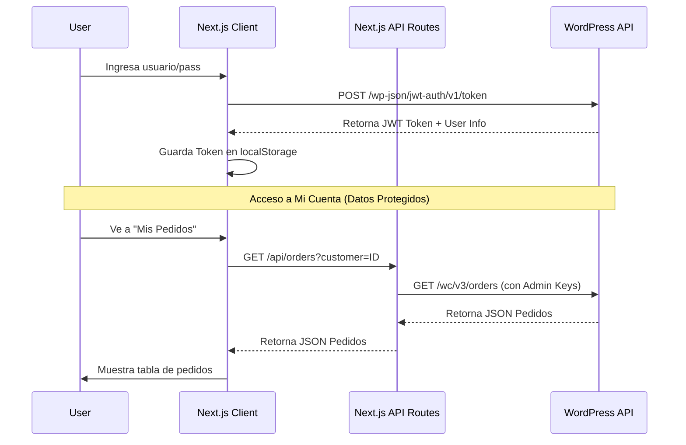

# Sistema de Autenticación WooCommerce - Headless

Este documento detalla la implementación del sistema de login y gestión de usuarios para la tienda PharmaPlus Headless. El sistema permite a los usuarios de WooCommerce autenticarse en el frontend de Next.js y acceder a su información de cuenta protegida.

## 1. Arquitectura General

El sistema utiliza una arquitectura **JWT (JSON Web Token)** para la autenticación sin estado (stateless).
*   **Backend (WordPress)**: Actúa como proveedor de identidad y API de datos.
*   **Frontend (Next.js)**: Maneja la sesión del usuario en el navegador y consume la API.
*   **Middleware/Proxy (Next.js API)**: Rutas intermedias para proteger credenciales sensibles de administración.



## 2. Requisitos Previos

Para que el sistema funcione, el backend de WordPress debe tener instalado y configurado:

*   **Plugin**: [JWT Authentication for WP-REST-API](https://es.wordpress.org/plugins/jwt-authentication-for-wp-rest-api/)
*   **Configuración `wp-config.php`**:
    ```php
    define('JWT_AUTH_SECRET_KEY', 'tu-clave-secreta-larga-y-segura');
    define('JWT_AUTH_CORS_ENABLE', true);
    ```

## 3. Componentes Clave

### 3.1 Librería de Autenticación (`lib/auth.ts`)
Es el núcleo del sistema en el cliente. Maneja la comunicación con el endpoint de login y la persistencia de sesión.
*   `login(username, password)`: Obtiene el token.
*   `logout()`: Elimina token y datos de usuario.
*   `isAuthenticated()`: Verifica si existe sesión activa.
*   `getUser()`: Retorna datos del usuario (nombre, email, id).

### 3.2 Rutas Protegidas (`app/mi-cuenta/`)
Todas las páginas bajo `/mi-cuenta` están protegidas por `layout.tsx`, el cual verifica `auth.isAuthenticated()`. Si no hay sesión, redirige automáticamente a `/login`.

### 3.3 Proxy API Routes (`app/api/`)
Debido a que algunas operaciones de WooCommerce (como ver pedidos de un usuario específico o editar clientes) requieren permisos de Administrador (Consumer Key/Secret), no podemos llamarlas directamente desde el navegador (expondría las claves).
Usamos "Proxy Routes" en Next.js que se ejecutan en el servidor:
*   `/api/orders`: Busca pedidos por ID de cliente o Email.
*   `/api/customer`: Obtiene y actualiza datos del perfil del cliente.

## 4. Guía de Uso para Desarrolladores

### Obtener Usuario Actual
```typescript
import { auth } from '@/lib/auth';

// En un componente (Client Side)
const user = auth.getUser();
console.log(user.name); // "Juan Perez"
```

### Proteger una Nueva Página
Simplemente coloca la página dentro de la carpeta `app/mi-cuenta/` o usa el hook de verificación:
```typescript
useLayoutEffect(() => {
    if (!auth.isAuthenticated()) router.push('/login');
}, []);
```

### Cerrar Sesión
```typescript
<button onClick={() => auth.logout()}>Salir</button>
```

## 5. Consideraciones de Seguridad
*   **Almacenamiento**: Actualmente el token se guarda en `localStorage` para facilidad de implementación.
*   **Mejora Futura (Recomendada)**: Migrar a `httpOnly cookies` para prevenir ataques XSS avanzados. Esto requeriría mover la lógica de login a un Route Handler de Next.js que setee la cookie desde el servidor.

---
*Documentación generada el 09 de Enero de 2026*
